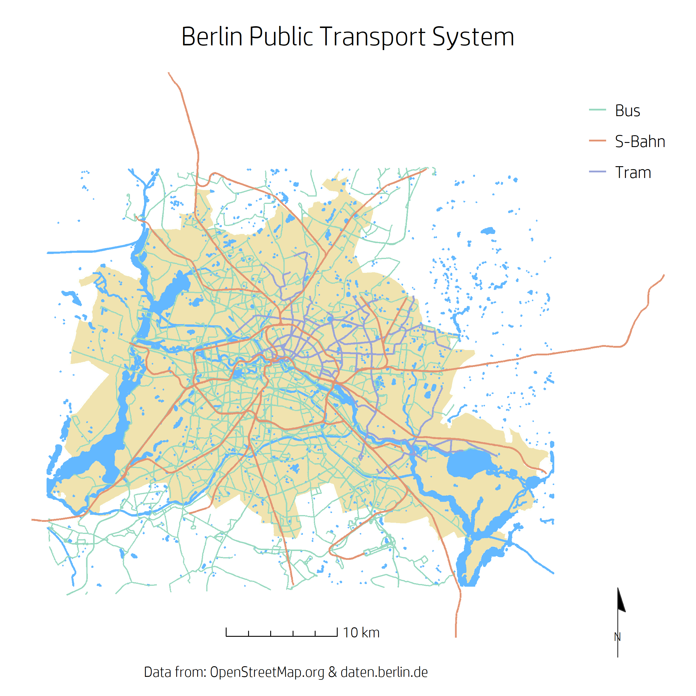
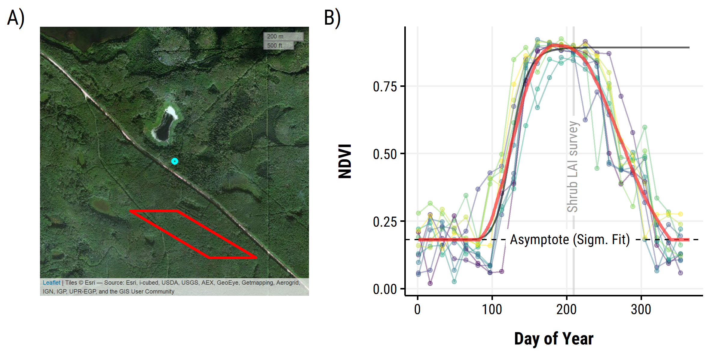

# Portfolio

[Code Examples](#code-examples) 
/ [Shiny Apps](#shiny-apps) 
/ [Software](#software) 
/ [Presentations](#presentations) 
/ [Workshops](#workshops)
/ [Visualizations](#visualizations)


This repository contains (links to) code and/or data products, as well as presentations I've developed and created in recent years.

## Code examples

### Data processing, statisitical modelling and visualization 

* **Processing, modelling and visualizing hydrological data in R**:  
This interactive document is an example of a reproducible analyses in `R`, using web APIs to obtain data, reading in non-standard tables with custom functions, reshaping and applying statistical models to infer best predictors of extreme river flows across catchments in the UK. The analyses relies heavily on the `tidyverse`, especially `purrr` for mapping custom (nested) functions to list-columns.  
**links**: [Document](https://aglhurley.rbind.io/ext_post/01_rhydro_aglhurley_proc-mod-viz) // [Rmarkdown (raw)](https://github.com/the-Hull/rHydro_2018/blob/master/presentation/01_rHydro_AGLHurley_proc-mod-viz.Rmd) - [](https://zenodo.org/badge/latestdoi/123999066)


```r
uk_nest <- models %>% 
  
  # use custom function and add id column
  map_df(apply_model, uk_nested, .id = "id_model") %>% 
  
  # carry over pertinent columns
  select(id_model, country, model) %>% 
  
  # add model coefficients and performance metrics to data frame.
  mutate(coefficients = map(model, tidy),
         performance = map(model, glance)) %>% 
  select(-model)

# see results  
uk_nest %>% head(20)

```


### Reproducible analyses applying `R` package development principles as *research compendium*

* **World Bank Population Data analyses**  
The brief analyses featured in an elaborate [blog post](https://the-hull.github.io/reproducibility_compendium/analyses/00_write-up.html) for my personal website on reproducibility approaches. In this case, the structure and methods for `R` package development were applied to allow attaching custom functions and data with documentation to anybody looking to explore or reproduce the analyses (or entire blog post). It heavily relies on `usethis`, the `tidyverse` as well as `rlang` non-standard evaluation to facilitate use with piping and `dplyr`. The source for the function `wb_change_percent` used below, including documentation, can be found [here](https://github.com/the-Hull/reproducibility_compendium/blob/master/R/wb_calc_change_percent.R).

```r
#load custom library containing research compendium
library(WBanalyses) 
library(dplyr)
library(ggplot2)

# calculate pop change for last 10 years in data set.
max_year <- max(pop_data$year)
start_year <- max_year - 10


# ?wb_change_percent for the documentation

# add "region" in ... before country_name to keep column in analyses
pop_change <- pop_data %>%
    WBanalyses::wb_change_percent(start_year = start_year,
                                  end_year = max_year,
                                  value_col = population,
                                  year_col = year,
                                  outname = "population_perc_change",
                                  region,
                                  country_name)


```


#### Scheduled/triggered version-control and management of a repository

This code snippet, as part of a automated, report-generation workflow, uses `git2r` to push results (parameterized reports) from a hosted instance of `R` on `TravisCI` back to a GitHub repository with encrypted authentification tokens.  
**links:** [Code (raw)]() // [GitHub repository (task automation)](https://github.com/the-Hull/02_task_automation/) (see [this presentation for more](https://hydrosoc.github.io/rhydro_EGU19/presentations/06_task_automation/06_task_automation.html#1))

```r
# set up repo and add remote
repo <- git2r::repository(".")
repo_url <- "https://github.com/the-Hull/02_task_automation.git"
git2r::remote_add(repo, name = "taskauto", url = repo_url)

# set user info for the hosted instance
# user name is used to check for manual vs. triggered actions
git2r::config(repo,
              user.email = "aghu@aghu.com",
              user.name = "travishull")

# authenticate and get repo
cred <- git2r::cred_token("GH_TOKEN")
git2r::checkout(repo, branch = "master")

# set up meta / commits
last_commit_author <- git2r::commits(repo = repo)[[1]]$author[[1]]
commit_message <- paste("Update reports: Travis Build")

# check whether report generation was triggered through manual file change
# this prevents an endless loop, restarting the TravisCI build after pushing
# reports back to GitHub
if (last_commit_author != "travishull"){

    git2r::checkout(repo, branch = "master")
    
    # git workflow
    git2r::add(repo, "*")
    git2r::commit(repo, message = commit_message)
    git2r::push(repo,
                name = "taskauto",
                refspec = "refs/heads/master",
                credentials = cred)

}


```


## Shiny Apps

* [**Birmingham Institute of Forest Research** (BIFoR)](https://www.birmingham.ac.uk/research/activity/bifor/index.aspx) Data Expliration Platform:   
**link**: [https://aglhurley.shinyapps.io/bifor/](https://aglhurley.shinyapps.io/bifor/)  
This in-devolopment `shiny` app is being built for the institute's staff as an exploration and data download portal, as well as for outreach and educational purposes. 
It was demonstrated at an outreach and education exchange workshop with members from UK higher education institutions. Ultimately, this app will feature live data, once the necessary infrastructure has been installed on-site.


## Software

### Authored:


* **datacleanr**:  
`R` package for Interactive and Reproducible Data Cleaning. 
datacleanr is developed using the shiny package, and relies on informative summaries, visual cues and interactive data selection and annotation. All data-altering operations are documented, and converted to valid R code (reproducible recipe), that can be copied, sent to an active RStudio script, or saved to disk.
**links**: [GitHub](https://github.com/the-Hull/datacleanr) // [package site](https://the-hull.github.io/datacleanr/index.html)


* **lib2bib**:  
`R` package to acknowledge other `R` packages. 
It allows to search for and cite all packages used in a file, directory or `RStudio` project via calls to `library()`, `require()` or using the `::` operator notation. It includes a shiny interface to select specific packages and save them to a text or `.bib` file. 
Future improvements will include the ability to supply a bibliography style file, and copying the output to the clipboard.  
**links**: [GitHub](https://github.com/the-Hull/lib2bib) // [package site](https://the-hull.github.io/lib2bib/index.html)


* **ROAR**:  
`R` package for Reproducible and Organized Assimilation Routines (*in development*). 
`ROAR` assists in assimilating heterogeneous data sources into a pre-defined format, using templated scripts. These scripts are pre-populated through a "meta table" that contains information on every data set (origin, time zone, units, table format, etc.).
**links**: [GitHub](https://github.com/the-Hull/ROAR) 

### Contributed:

* **TREX**:  
Assimilate, process and analyse thermal dissipation sap flow data `R`. 
`TREX` allows to assimilate, process and analyse sap flow data obtained with the thermal dissipation method (TDM). The package includes functions for gap filling time-series data, detecting outliers, calculating data-processing uncertainties and generating uniform data output and visualisation. The package is designed to deal with large quantities of data and apply commonly used data-processing methods.
**links**: [GitHub](https://github.com/the-Hull/TREX) //  [CRAN](https://cran.r-project.org/web/packages/TREX/index.html) // [accompanying publication (*Methods in Ecology and Evolution*)](https://doi.org/10.1111/2041-210X.13524)

* **RAPTOR**:  
Row and Position Tracheid Organizer in `R`.
`R` package for wood anatomical analyses, allowing to pre-process, filter and extract cell properties from wood thinsections, significantly simplifying the process of extracting information for further processing.
My role in this package was to refactor and re-structure code to ensure compliance with CRAN requirements and best-practices.  
**links**: [GitHub](https://github.com/the-Hull/raptor) //  [CRAN](https://cran.r-project.org/web/packages/RAPTOR/index.html) // [accompanying publication (*Dendrochronologia*)](https://www.sciencedirect.com/science/article/pii/S1125786517301236)


## Presentations

* **Introduction to R - project set-up, data management and coding** (2015). 
This presentation was delivered to the physical geography department during a dedicated seminar at University of Birmingham. The focus was set presenting approaches to ensure projects were set up in a coherent, machine-readable and reproducible manner.  
**links:** [slides (PDF)](/doc/presentations/Introduction-to-R.pdf)

* **Intro to project management with git, GitHub and RStudio** (2018).  
This presentation was delivered to the water science research group during a dedicated seminar at University of Birmingham and included best practices in version controlling, project set-up, reproducible workflows and live coding sessions.  
**links:** [slides (react.js)](https://the-hull.github.io/intro_projects/#1) // [Rmarkdown (raw)](https://github.com/the-Hull/intro_projects/blob/master/04_presentation/intro_project_management.Rmd)

* **Staying up-to date: automating tasks from downloading data to reporting** (2019).  
Delivered at the European Geophysical Union General Assembly, this presentation was directed at geo-scientists looking to automate data aquisition, reporting and visualization, relying on `Rmarkdown`, `GitHub` and `TravisCI`.  
**links:** [slides (react.js)](https://hydrosoc.github.io/rhydro_EGU19/presentations/06_task_automation/06_task_automation.html#1) // [Rmarkdown (raw)](https://github.com/hydrosoc/rhydro_EGU19/blob/master/presentations/06_task_automation/06_task_automation.Rmd)

* **Obtaining, cleaning and visualizing hydrological data with R** (2019).  
Delivered at the European Geophysical Union General Assembly, this presentation showcased a suite of open-source software (`R` packages) that can facilitate typical workflows while enhancing reproducibility, including downloading, processing and visualizing results.  
**links**: [slides (react.js)](https://hydrosoc.github.io/rhydro_EGU19/presentations/03_get_clean_viz/03_get-clean-viz.html#1) // [Rmarkdown (raw)](https://github.com/hydrosoc/rhydro_EGU19/blob/master/presentations/03_get_clean_viz/03_get-clean-viz.Rmd)


## Workshops

**Using R in Hydrology**   
This short course, delivered at the European Geophysical Union General Assembly, has been run in association with the [Young Hydrologic Society](https://younghs.com/) since 2017. 
I've contributed in 2018 and took over convener's duties in 2019, organizing speakers, materials (syllabus and archiving); I also developed a consistent theme and logo based on `xaringan` and the common `R` hex-logo.  
The strong community focus driving this workshop led to a collaborative effort in authoring a discussion paper, titled ["*Using R in hydrology: a review of recent developments and future directions*" (Slater *et al.*, 2019)](https://doi.org/10.5194/hess-2019-50) in *Hydrology and Earth System Sciences*.


**2018 Workshop**: [GitHub repository](https://github.com/hydrosoc/rhydro_EGU18) - [](https://zenodo.org/badge/latestdoi/116503839)

**2019 Workshop**: [GitHub repository](https://github.com/hydrosoc/rhydro_EGU19) - [](https://zenodo.org/badge/latestdoi/169320856)

---

**Advanced Analyses of Tree Physiological Time Series in R and PhytoSim; ESA Annual Meeting, Virtual (2020)** 


 
<br>
This workshop was delivered at the Ecological Society of America's Annual Meeting in a virtual format as a collaborative and inter-disciplanry effort.  


**2020 Workshop**: [Materials](https://deep-tools.netlify.app/docs-workshops/esa-workshop2020/) //  [GitHub repository](https://github.com/deep-org/workshop_data/tree/master/esa-workshop2020)


## Visualizations

### Spatial / Scientific

<p style="text-align:center;">

<a href="https://raw.githubusercontent.com/the-Hull/code_portfolio/master/doc/img/gallery/00_URSA_P19.png" width = 300px height = 200px target="_blank">
 </a>

<a href="https://raw.githubusercontent.com/the-Hull/code_portfolio/master/doc/img/gallery/01_berlin_transport_overview.png" width = 300px height = 300px target="_blank">
 </a> 

<a href="https://raw.githubusercontent.com/the-Hull/code_portfolio/master/doc/img/gallery/09_map_patch_ndvi_scaling.png" width = 300px height = 200px target="_blank">
 </a>
<br/>


<a href="https://raw.githubusercontent.com/the-Hull/code_portfolio/master/doc/img/gallery/RWI_x_y__ASP_WSPR_HSB_HSM.png" width = 200px height = 500 px target="_blank">
 </a>

<a href="https://raw.githubusercontent.com/the-Hull/code_portfolio/master/doc/img/gallery/07_et_pred_performance.png" width = 300px height = 300px target="_blank">
 </a>
</p>

<a href="https://raw.githubusercontent.com/the-Hull/code_portfolio/master/doc/img/gallery/07_hysteresis_precip_res.png" width = 300px height = 300px target="_blank">
 </a>
</p>


